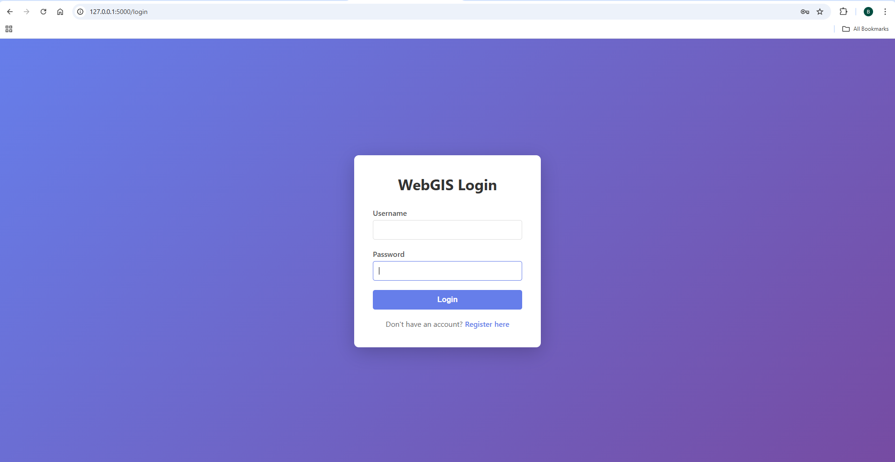
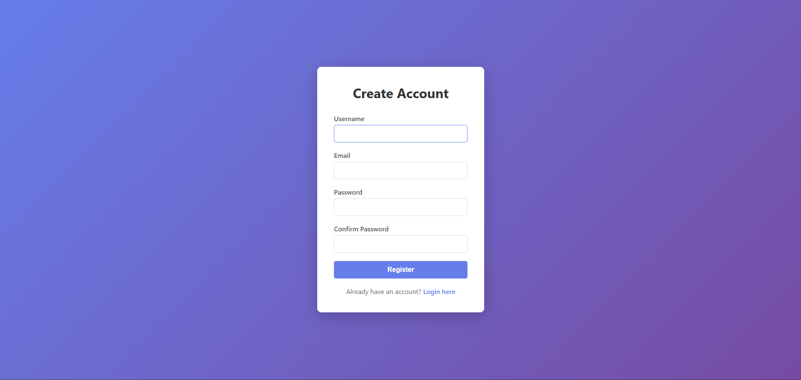
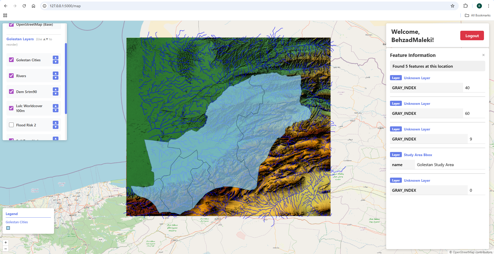
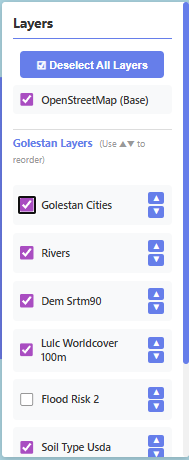
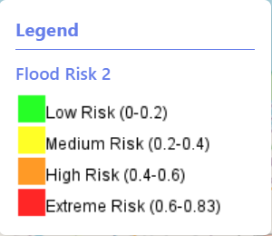
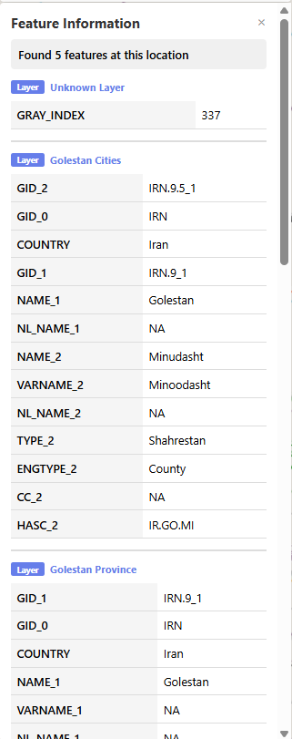

# WebGIS Application with Flask & OpenLayers

A full-featured WebGIS application built with Flask backend and OpenLayers frontend, featuring user authentication, interactive maps, local GeoServer integration with dynamic layer management, custom styling, and real-time legend display.


---

## 📋 Table of Contents

- [Features](#-features)
- [Demo](#-demo)
- [Installation](#-installation)
- [Usage](#-usage)
- [Project Structure](#-project-structure)
- [Technologies Used](#-technologies-used)
- [Configuration](#-configuration)
- [API Endpoints](#-api-endpoints)
- [Screenshots](#-screenshots)
- [Troubleshooting](#-troubleshooting)
- [Contributing](#-contributing)
- [License](#-license)
- [Contact](#-contact)

---

## ✨ Features

### Authentication System
- **User Registration**: Create new accounts with email validation
- **Secure Login**: Session-based authentication with cookies
- **Password Validation**: Password confirmation and matching checks
- **Protected Routes**: Map page only accessible to authenticated users
- **Session Management**: 1-hour session timeout with automatic logout

### Interactive Map
- **OpenStreetMap Base Layer**: Free, high-quality base map
- **Local GeoServer Integration**: Connect to your own GeoServer instance
- **Dynamic Layer Loading**: Automatically detects all layers from GeoServer workspace via GetCapabilities API
- **Layer Management Panel**: Toggle layers on/off with intuitive checkboxes
- **Layer Reordering**: Use ▲▼ buttons to change layer stacking order
- **Bulk Layer Control**: Select/Deselect all layers with one click
- **Custom SLD Styles**: Apply custom Styled Layer Descriptor (SLD) styles to layers
- **Real-time Legend**: Dynamic legend panel showing topmost visible layer
- **GetFeatureInfo**: Click on map features to view attributes
- **CORS Proxy**: Built-in proxy to handle cross-origin requests
- **Responsive Design**: Works on desktop, tablet, and mobile devices
- **Loading Indicators**: Visual feedback during data loading
- **Interactive Cursor**: Pointer cursor over clickable features

### GeoServer Features
- **Workspace Support**: Load all layers from a specific workspace (e.g., "golestan")
- **Multiple Layer Types**: Support for rasters (GeoTIFF, DEM) and vectors (shapefiles, polygons, lines, points)
- **Style Management**: Create and apply custom SLD styles for advanced visualization
- **GetLegendGraphic**: Automatic legend generation from GeoServer
- **Easy Switching**: Toggle between local and public GeoServer with one configuration flag

### Data Layers (Example: Golestan Province, Iran)
- **Rivers**: Blue-styled water features
- **Cities**: Point features with population data
- **Province Boundary**: Administrative boundaries
- **Study Area**: Region of interest bounding box
- **Flood Risk**: Continuous raster with 4-color classification
- **Land Use/Land Cover**: ESA WorldCover 100m classification (11 categories)

### User Interface
- **Modern Design**: Clean, professional interface with gradient backgrounds
- **Responsive Layout**: Mobile-friendly design
- **Error Handling**: User-friendly error messages
- **Success Notifications**: Feedback for successful actions
- **Feature Info Panel**: Displays properties with layer name badges
- **Legend Panel**: Shows color ramps and symbology for active layer

---

## 🎬 Demo

### Login Page

The application starts with a secure login page featuring a modern purple gradient design.

### Registration

New users can easily register with username, email, and password.

### Interactive Map with Dynamic Layers

Once logged in, users can:
- Pan and zoom the map
- Toggle multiple WMS layers from local GeoServer
- Reorder layers using ▲▼ buttons (top = front)
- Select/Deselect all layers with one click
- View dynamic legend for the topmost visible layer
- Click on features to see detailed attributes

### Layer Control Panel

- Checkbox for each layer (on/off toggle)
- Reorder buttons (▲▼) to change layer stacking
- Bulk control button (Select All / Deselect All)
- Scrollable for many layers

### Dynamic Legend

- Automatically shows legend for topmost visible layer
- Updates when toggling or reordering layers
- Displays color ramps, symbols, and classifications


### Feature Info Panel

- Click any feature to view attributes
- Shows layer name badge
- Formatted property table
- Close button for clean interface

---

## 🚀 Installation

### Prerequisites
- Python 3.10 or higher
- pip (Python package manager)
- Web browser (Chrome, Firefox, Edge, Safari)
- **GeoServer** (for local data serving) - Optional, can use public GeoServer
- Java 11 or higher (required for GeoServer)

### Quick Start (No GeoServer Required)

If you want to test the application without setting up GeoServer, it defaults to using a public demo GeoServer.

### Step 1: Clone the Repository
```bash
git clone <your-repository-url>
cd kntu4041_A3_BehzadMaleki
```

### Step 2: Create Virtual Environment
```bash
# Windows
python -m venv flaskvenv
flaskvenv\Scripts\activate

# Mac/Linux
python3 -m venv flaskvenv
source flaskvenv/bin/activate
```

### Step 3: Install Dependencies
```bash
pip install -r requirements.txt
```

### Step 4: Run the Application
```bash
python app.py
```

The application will start on `http://127.0.0.1:5000`

### Setting Up Local GeoServer (Recommended)

For the full experience with your own data:

1. **Install GeoServer**
   - See `guides/GEOSERVER_SETUP_GUIDE.md` for complete instructions
   - Download from: https://geoserver.org/download/
   - Install to a permanent location (e.g., `C:\geoserver`)

2. **Start GeoServer**
   ```bash
   # Windows - Use provided script
   start_geoserver.bat
   
   # Or manually
   cd C:\geoserver\bin
   startup.bat
   ```
   Access at: http://localhost:8081/geoserver
   - Default username: `admin`
   - Default password: `geoserver`

3. **Add Your Data**
   - Create a workspace (e.g., "golestan")
   - Add stores (GeoTIFF, Shapefiles, PostGIS)
   - Publish layers
   - Create custom SLD styles (examples in `sld_styles/`)

4. **Configure Application**
   Edit `static/js/map_dynamic.js`:
   ```javascript
   const USE_LOCAL_GEOSERVER = true;  // Set to true for local GeoServer
   ```

📖 **Detailed Guides Available:**
- `guides/FLASK_GUIDE.md` - Step-by-step Flask implementation
- `guides/GEOSERVER_SETUP_GUIDE.md` - GeoServer installation from scratch
- `guides/START_GEOSERVER_GUIDE.md` - Quick reference for starting GeoServer
- `guides/GEOSERVER_SWITCH_GUIDE.md` - Switching between local/public GeoServer
- `guides/DYNAMIC_LAYERS_GUIDE.md` - Dynamic vs manual layer management
- `guides/GEOSERVER_STYLES_GUIDE.md` - Creating custom SLD styles

---

## 💻 Usage

### First Time Setup

1. **Start the Server**
   ```bash
   python app.py
   ```

2. **Open Your Browser**
   Navigate to: `http://127.0.0.1:5000`

3. **Register an Account**
   - Click "Register here"
   - Fill in: username, email, password, confirm password
   - Click "Register"

4. **Login**
   - Enter your username and password
   - Click "Login"

5. **Explore the Map**
   - Pan by clicking and dragging
   - Zoom with mouse wheel or +/- buttons
   - Click on US states to view information
   - Close info panel with × button
   - Logout with top-right button

### Testing Authentication
Visit `/debug` endpoint to check session and cookie status:
```
http://127.0.0.1:5000/debug
```

---

## 📁 Project Structure

```
kntu4041_A3_BehzadMaleki/
│
├── app.py                      # Flask application (main backend with CORS proxy)
├── requirements.txt            # Python dependencies
├── .gitignore                  # Git ignore rules
├── README.md                   # This file (complete documentation)
│
├── guides/                     # 📚 Documentation & Tutorials
│   ├── FLASK_GUIDE.md         # Flask learning guide
│   ├── GEOSERVER_SETUP_GUIDE.md    # GeoServer installation from scratch
│   ├── START_GEOSERVER_GUIDE.md    # Quick start guide for GeoServer
│   ├── GEOSERVER_SWITCH_GUIDE.md   # Switch between local/public GeoServer
│   ├── DYNAMIC_LAYERS_GUIDE.md     # Dynamic layer management explained
│   └── GEOSERVER_STYLES_GUIDE.md   # Creating custom SLD styles
│
├── sld_styles/                 # 🎨 Styled Layer Descriptor Files
│   ├── flood_risk_raster.sld  # 4-color flood risk classification
│   ├── lulc_worldcover.sld    # Land Use/Land Cover 11 categories
│   ├── dem_shaded_relief.sld  # Shaded relief for elevation (example)
│   ├── cities_labeled.sld     # Point symbols with labels (example)
│   ├── flood_risk_zones.sld   # Polygon flood zones (example)
│   └── flood_depth.sld        # Water depth blue scale (example)
│
├── screenshots/                # 📸 Application Screenshots
│   ├── login.png              # Login page
│   ├── register.png           # Registration page
│   ├── map_interface.png      # Full map view
│   ├── layer_panel.png        # Layer control panel
│   ├── legend.png             # Dynamic legend panel
│   ├── feature_info.png       # Feature info popup
│   ├── flood_risk.png         # Flood risk layer visualization
│   └── lulc.png               # Land cover layer visualization
│
├── templates/                  # HTML templates (Jinja2)
│   ├── login.html             # Login page
│   ├── register.html          # Registration page
│   └── map.html               # Protected map page with dynamic layers
│
├── static/                     # Static files
│   ├── css/
│   │   └── style.css          # All application styles
│   └── js/
│       ├── map_dynamic.js     # ✅ ACTIVE: Dynamic layer loading
│       └── map.js             # FALLBACK: Manual layer configuration
│
├── start_geoserver.bat         # Windows batch script for GeoServer
└── start_geoserver.ps1         # PowerShell script for GeoServer
```

### Key Files

**Backend:**
- `app.py` - Flask routes, authentication, session management, CORS proxy at `/geoserver-proxy`

**Frontend:**
- `templates/map.html` - Map page with layer panel and legend containers
- `static/js/map_dynamic.js` - Auto-loads layers via GetCapabilities, manages layer order, updates legend
- `static/css/style.css` - Responsive styling for layer panel, legend, and map interface

**Data & Styling:**
- `sld_styles/*.sld` - Ready-to-use SLD files for GeoServer styling
- `guides/*.md` - Complete documentation for all features

**Convenience Scripts:**
- `start_geoserver.bat` - One-click GeoServer startup (Windows)
- `start_geoserver.ps1` - PowerShell alternative

---

## 🛠 Technologies Used

### Backend
- **Flask 3.1.2**: Python web framework
- **Requests 2.32.3**: HTTP library for CORS proxy
- **Werkzeug 3.1.5**: WSGI utilities and security
- **Jinja2 3.1.6**: Template engine
- **Python 3.14**: Programming language

### Frontend
- **HTML5**: Page structure
- **CSS3**: Styling and responsive design (Flexbox, Grid)
- **JavaScript (ES6+)**: Interactive functionality, async/await
- **OpenLayers 7.3.0**: Web mapping library (CDN)

### GIS Stack
- **GeoServer**: Open-source GIS server for publishing spatial data
- **OGC WMS**: Web Map Service for raster/vector rendering
- **OGC SLD**: Styled Layer Descriptor for cartographic styling
- **GetCapabilities API**: Dynamic layer discovery
- **GetFeatureInfo**: Attribute query on click
- **GetLegendGraphic**: Automatic legend generation

### Data Sources
- **OpenStreetMap**: Base map tiles (Humanitarian style)
- **Local GeoServer**: Custom workspace with 6+ layers
- **ESA WorldCover**: 100m Land Use/Land Cover dataset
- **Custom Flood Risk Data**: Raster analysis results

### Development Tools
- **Git**: Version control
- **VS Code**: Code editor
- **Browser DevTools**: Debugging and testing

---

## ⚙️ Configuration

### Switching Between Local and Public GeoServer

Edit `static/js/map_dynamic.js`:

```javascript
// Set to true for your local GeoServer
// Set to false to use public demo GeoServer
const USE_LOCAL_GEOSERVER = true;

const LOCAL_GEOSERVER = {
    url: '/geoserver-proxy',      // Uses Flask CORS proxy
    workspace: 'golestan',         // Your workspace name
    center: [55.3, 37.3],         // Map center [longitude, latitude]
    zoom: 8                        // Initial zoom level
};
```

### Applying Custom SLD Styles

1. **Create SLD file** in `sld_styles/` (or use provided examples)
2. **Upload to GeoServer**:
   - Go to http://localhost:8081/geoserver
   - Navigate to **Data** → **Styles** → **Add new style**
   - Paste SLD content, validate, submit
3. **Apply to layer**:
   - Go to **Layers** → Select your layer → **Publishing** tab
   - Set **Default Style** to your new style
4. **Configure in code** (optional):
   ```javascript
   const LAYER_STYLES = {
       'flood_risk_2': 'flood_risk_raster',
       'LULC_WorldCover_100m': 'lulc_worldcover'
   };
   ```

### Adding New Layers

**No code changes needed!** The application automatically detects new layers:

1. Publish a new layer in GeoServer (same workspace)
2. Refresh your browser
3. Layer appears in the panel automatically

See `guides/DYNAMIC_LAYERS_GUIDE.md` for details.

### CORS Proxy Configuration

The Flask app includes a built-in proxy at `/geoserver-proxy` to handle cross-origin requests:

```python
# In app.py
@app.route('/geoserver-proxy', methods=['GET'])
def geoserver_proxy():
    geoserver_url = f"http://localhost:8081/geoserver/wms?{request.query_string.decode()}"
    response = requests.get(geoserver_url, timeout=30)
    # Adds CORS headers automatically
```

### Environment Variables

For production, set these environment variables:

```bash
# Flask configuration
export FLASK_ENV=production
export FLASK_SECRET_KEY=your-secret-key-here
export FLASK_DEBUG=0

# GeoServer configuration
export GEOSERVER_URL=http://your-geoserver:8080/geoserver
export GEOSERVER_WORKSPACE=your_workspace
```

---

## 🔌 API Endpoints

### Public Routes
| Method | Endpoint | Description |
|--------|----------|-------------|
| GET | `/` | Redirects to login |
| GET/POST | `/login` | Login page and authentication |
| GET/POST | `/register` | Registration page and user creation |

### Protected Routes (Require Authentication)
| Method | Endpoint | Description |
|--------|----------|-------------|
| GET | `/map` | Interactive map page |
| GET | `/logout` | Logout and clear session |
| GET | `/debug` | Debug session/cookie info (dev only) |

### Proxy Routes
| Method | Endpoint | Description |
|--------|----------|-------------|
| GET | `/geoserver-proxy` | CORS proxy for GeoServer WMS requests |

### Route Details

#### POST `/login`
**Request Body:**
```json
{
  "username": "string",
  "password": "string"
}
```
**Response:** Redirect to `/map` with session cookie

#### POST `/register`
**Request Body:**
```json
{
  "username": "string",
  "email": "string",
  "password": "string",
  "confirm_password": "string"
}
```
**Response:** Redirect to `/login` with success message

#### GET `/geoserver-proxy`
**Query Parameters:** Standard WMS parameters (SERVICE, REQUEST, LAYERS, etc.)  
**Purpose:** Forwards WMS requests to localhost:8081/geoserver with CORS headers  
**Example:**
```
/geoserver-proxy?SERVICE=WMS&REQUEST=GetMap&LAYERS=golestan:rivers&...
```

---

## 📸 Screenshots

### 1. Login Page

- Modern purple gradient background
- Clean white form box with shadow
- Error/success message display area
- Link to registration page

### 2. Registration Page

- All required fields with validation
- Password confirmation field
- Duplicate username checking
- Link back to login page

### 3. Map Interface (Full View)

- Full-screen interactive map
- Layer control panel (top-left)
- Legend panel (bottom-left, above zoom controls)
- Header with username and logout button
- Multiple WMS layers overlay on OSM base map

### 4. Layer Control Panel

- **OSM Base Layer** checkbox (always present)
- **GeoServer Layers** section with:
  - Individual checkboxes for each layer
  - ▲▼ reorder buttons (top = front on map)
  - "Select All / Deselect All" bulk control button
- Scrollable list for many layers
- Instructions text: "(Use ▲▼ to reorder)"

### 5. Dynamic Legend Panel

- Shows legend for **topmost visible layer**
- Updates automatically when:
  - Toggling layers on/off
  - Reordering layers with ▲▼
  - Using "Select All / Deselect All"
- Displays color ramps, symbols, and classifications from GeoServer
- Positioned above zoom controls

### 6. Flood Risk Visualization

- **4-color classification**:
  - Green: Low Risk (0-0.2)
  - Yellow: Medium Risk (0.2-0.4)
  - Orange: High Risk (0.4-0.6)
  - Red: Extreme Risk (0.6-0.83)
- Semi-transparent overlay (85% opacity)
- Legend showing all categories

### 7. Land Use/Land Cover (LULC)

- **ESA WorldCover 100m** classification
- **11 distinct categories**:
  - Tree Cover (dark green)
  - Shrubland (orange)
  - Grassland (yellow)
  - Cropland (pink)
  - Built-up/Urban (red)
  - Bare/Sparse Vegetation (gray)
  - Snow/Ice (white)
  - Water Bodies (blue)
  - Wetland (teal)
  - Mangroves (light green)
  - Moss/Lichen (beige)

### 8. Feature Info Panel

- **Triggered by**: Clicking any feature on map
- **Displays**:
  - Layer name badge at top (e.g., "Rivers", "Cities")
  - Property table with all attributes
  - Formatted key-value pairs
- **Features**:
  - Close button (×) in top-right
  - Scrollable content for long attribute lists
  - Support for multiple features (shows all clicked features)
  - Bottom-right positioning (doesn't overlap controls)

### 9. Layer Reordering Demo

- Shows ▲▼ buttons in action
- Demonstrates layer stacking:
  - Top of panel = front on map (highest z-index)
  - Bottom of panel = back on map (lowest z-index)
- Arrows highlight current positions

### 10. Bulk Layer Control

- Button showing "☑ Deselect All Layers" (when all visible)
- Changes to "☐ Select All Layers" (when some/all hidden)
- Updates all checkboxes simultaneously
- Legend updates to show topmost remaining visible layer

---

## 🐛 Troubleshooting

### Common Issues

#### 1. Flask Server Won't Start
```bash
# Check if port 5000 is already in use
# Windows:
netstat -ano | findstr :5000

# Mac/Linux:
lsof -i :5000

# Kill the process or use a different port
export FLASK_RUN_PORT=5001
python app.py
```

#### 2. Module Not Found Error
```bash
# Ensure virtual environment is activated
# Windows:
flaskvenv\Scripts\activate

# Mac/Linux:
source flaskvenv/bin/activate

# Reinstall dependencies
pip install -r requirements.txt
```

#### 3. Map Not Loading
- Check browser console for errors (F12)
- Verify internet connection (CDN resources)
- Check GeoServer URL is accessible
- Verify CORS is enabled on GeoServer

#### 4. GetFeatureInfo Not Working
- Ensure clicking on actual features (not empty space)
- Check browser Network tab for WMS requests
- Verify GeoServer supports GetFeatureInfo
- Check INFO_FORMAT is supported (application/json)

#### 5. Session/Cookie Issues
- Clear browser cookies for localhost
- Check browser allows cookies
- Verify `app.secret_key` is set
- Use browser DevTools > Application > Cookies

#### 6. Python Version Compatibility
```bash
# Check Python version
python --version

# If version is too old, upgrade or use pyenv
# Windows: Download from python.org
# Mac: brew install python@3.14
# Linux: apt install python3.14
```

---

## 🤝 Contributing

Contributions are welcome! Please follow these steps:

1. **Fork the Repository**
2. **Create a Feature Branch**
   ```bash
   git checkout -b feature/AmazingFeature
   ```
3. **Commit Your Changes**
   ```bash
   git commit -m 'Add some AmazingFeature'
   ```
4. **Push to the Branch**
   ```bash
   git push origin feature/AmazingFeature
   ```
5. **Open a Pull Request**

### Development Guidelines
- Write clean, commented code
- Follow PEP 8 style guide for Python
- Test all features before submitting
- Update documentation as needed

---

## 🔒 Security Considerations

### Current Implementation (Development)
⚠️ **Warning**: This is a development version with simplified security.

**Known Limitations:**
- Passwords stored in plain text (in-memory dictionary)
- No database persistence
- Simple session management
- Debug routes exposed

### Production Recommendations

1. **Hash Passwords**
   ```python
   from werkzeug.security import generate_password_hash, check_password_hash
   
   # When registering
   hashed_password = generate_password_hash(password)
   
   # When logging in
   check_password_hash(stored_hash, password)
   ```

2. **Use a Database**
   - SQLite for small projects
   - PostgreSQL for production
   - MongoDB for NoSQL approach

3. **Secure Secret Key**
   ```python
   import os
   app.secret_key = os.environ.get('SECRET_KEY')
   ```

4. **Remove Debug Routes**
   - Delete or protect the `/debug` endpoint
   - Set `debug=False` in production

5. **HTTPS Only**
   - Use SSL certificates
   - Set secure cookie flags
   - Enable HSTS headers

6. **Rate Limiting**
   - Implement Flask-Limiter
   - Prevent brute force attacks

---

## 📚 Learning Resources

- **Flask Documentation**: https://flask.palletsprojects.com/
- **OpenLayers Documentation**: https://openlayers.org/en/latest/apidoc/
- **GeoServer Documentation**: https://docs.geoserver.org/
- **WMS Specification**: https://www.ogc.org/standards/wms

---

## 🎓 Academic Context

This project was developed as part of the **WebGIS Course** at K.N. Toosi University of Technology.

**Assignment**: Final Project (50% of TA evaluation)  
**Course**: Web GIS  
**Student**: Behzad Maleki  
**Student ID**: kntu4041  
**Assignment**: A3

---

## 📝 License

This project is licensed under the MIT License - see below for details:

```
MIT License

Copyright (c) 2026 Behzad Maleki

Permission is hereby granted, free of charge, to any person obtaining a copy
of this software and associated documentation files (the "Software"), to deal
in the Software without restriction, including without limitation the rights
to use, copy, modify, merge, publish, distribute, sublicense, and/or sell
copies of the Software, and to permit persons to whom the Software is
furnished to do so, subject to the following conditions:

The above copyright notice and this permission notice shall be included in all
copies or substantial portions of the Software.

THE SOFTWARE IS PROVIDED "AS IS", WITHOUT WARRANTY OF ANY KIND, EXPRESS OR
IMPLIED, INCLUDING BUT NOT LIMITED TO THE WARRANTIES OF MERCHANTABILITY,
FITNESS FOR A PARTICULAR PURPOSE AND NONINFRINGEMENT. IN NO EVENT SHALL THE
AUTHORS OR COPYRIGHT HOLDERS BE LIABLE FOR ANY CLAIM, DAMAGES OR OTHER
LIABILITY, WHETHER IN AN ACTION OF CONTRACT, TORT OR OTHERWISE, ARISING FROM,
OUT OF OR IN CONNECTION WITH THE SOFTWARE OR THE USE OR OTHER DEALINGS IN THE
SOFTWARE.
```

---

## 👤 Contact

**Behzad Maleki**  
Student ID: kntu4041  
K.N. Toosi University of Technology

**Project Repository**: [GitHub Repository Link]  
**Live Demo**: [If deployed, add URL here]

---

## 🙏 Acknowledgments

- **OpenStreetMap Contributors** for base map data
- **GeoServer Community** for the open-source GIS server
- **OpenLayers Team** for the excellent web mapping library
- **Flask Community** for the lightweight web framework
- **K.N. Toosi University of Technology** for the course and guidance

---

## 📈 Future Enhancements

Potential improvements for future versions:

### Security & Authentication
- [ ] Database integration (PostgreSQL/SQLite)
- [ ] Password hashing (Werkzeug security)
- [ ] User profile management
- [ ] Email verification for registration
- [ ] Password reset functionality
- [ ] Remember me checkbox
- [ ] Admin dashboard for user management

### Map Features
- [x] **Multiple WMS layer support with layer switcher** ✅ COMPLETED
- [x] **Dynamic layer loading from GeoServer** ✅ COMPLETED
- [x] **Layer reordering functionality** ✅ COMPLETED
- [x] **Custom styling for WMS layers (SLD)** ✅ COMPLETED
- [x] **Real-time legend display** ✅ COMPLETED
- [ ] Drawing and measurement tools (distance, area)
- [ ] Export map to PDF/PNG
- [ ] Search functionality (geocoding with Nominatim)
- [ ] Map bookmarks/favorites
- [ ] Print layout designer
- [ ] Coordinate display (mouse position)
- [ ] Scale bar and north arrow

### Advanced GIS
- [ ] WFS integration (editable vector layers)
- [ ] WCS integration (coverage data)
- [ ] Time-series animation
- [ ] 3D terrain visualization (Cesium.js)
- [ ] Heatmap generation
- [ ] Clustering for point data
- [ ] Spatial query builder
- [ ] Buffer and overlay analysis
- [ ] Custom attribute filtering

### Data Management
- [ ] Upload shapefile/GeoJSON
- [ ] Data export (GeoJSON, KML, CSV)
- [ ] Batch style application
- [ ] Layer metadata viewer
- [ ] Version control for styles
- [ ] User-specific layer sets

### UI/UX Improvements
- [ ] Dark mode theme
- [ ] Custom basemap selector
- [ ] Layer opacity sliders
- [ ] Context menu (right-click)
- [ ] Keyboard shortcuts
- [ ] Touch gesture support (mobile)
- [ ] Fullscreen mode

---

## 📊 Version History

### v2.0.0 (February 2026) - Current Version
**Major Update: GeoServer Integration & Dynamic Layer Management**

✨ **New Features:**
- Local GeoServer integration with workspace support
- Dynamic layer loading via GetCapabilities API
- Layer reordering with intuitive ▲▼ controls
- Bulk layer control (Select All / Deselect All)
- Real-time legend panel showing topmost visible layer
- Custom SLD style support with configuration
- CORS proxy at `/geoserver-proxy`
- Auto-detection of new layers (no code changes needed)
- 6+ example SLD styles for various layer types
- Comprehensive documentation (6 guide files)

🔧 **Technical Improvements:**
- Added `requests` library for server-to-server communication
- Implemented `map_dynamic.js` with async/await patterns
- Created organized folder structure (guides/, sld_styles/, screenshots/)
- Enhanced CSS with flexbox layouts and custom scrollbars
- Layer panel shortened to 50vh to avoid legend overlap
- Improved error handling and loading indicators

📚 **Documentation:**
- Added GEOSERVER_SETUP_GUIDE.md
- Added GEOSERVER_STYLES_GUIDE.md
- Added DYNAMIC_LAYERS_GUIDE.md
- Added GEOSERVER_SWITCH_GUIDE.md
- Added START_GEOSERVER_GUIDE.md
- Provided 6 ready-to-use SLD examples
- Created convenience scripts (start_geoserver.bat/.ps1)

🐛 **Bug Fixes:**
- Fixed SLD XML namespace issues (ogc prefix)
- Fixed RasterSymbolizer element ordering (ColorMap before ShadedRelief)
- Fixed TextSymbolizer element ordering (Halo before Fill)
- Resolved CORS errors with Flask proxy
- Corrected layer stacking order (top of panel = front on map)

---

### v1.0.0 (February 2026)
**Initial Release**

- User authentication system (register/login/logout)
- Session-based security with cookies (1-hour expiry)
- Interactive map with OpenLayers 7.3.0
- Single WMS layer integration (public GeoServer)
- GetFeatureInfo functionality
- Responsive design
- Loading indicators
- Debug tools (`/debug` endpoint)
- In-memory user storage

---

**Last Updated**: February 13, 2026  
**Current Version**: 2.0.0  
**Status**: ✅ Production Ready (with security recommendations for deployment)

---

*This project demonstrates modern web development practices combining backend Python/Flask with frontend JavaScript mapping libraries to create a functional WebGIS application.*
